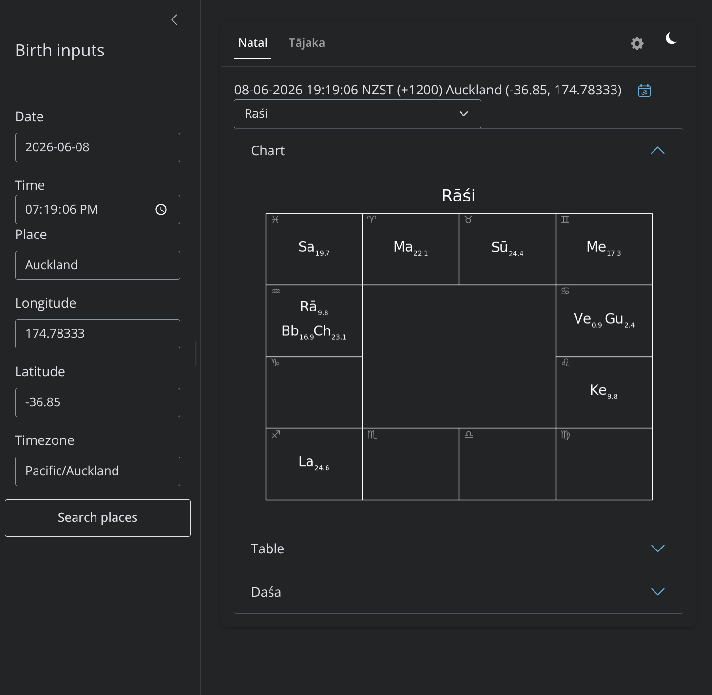

# Navgraha

A vedic astrology service, built with a focus on speed and accessibility. Installing the service once means many clients (devices) can access the app without the need to install anything on their devices, as long as they have a browser.

## About the Project

Navgraha was created to provide practicing astrologers, students, and enthusiasts with an elegant, ad-free, and streamlined interface that operates flawlessly across all devices—without relying on legacy software or web tools cluttered with advertisements.

The engine supports some custom calculation parameters, including your choice of ayanāṃśa, variations of vargas, and temporal variations in tājaka calculations.

## Features

### Ṣoḍaśavargas
Generate and dynamically explore all sixteen classical divisional charts (*vargas*) derived from the primary *Rāśi* chart.

### Viṃśottarī daśā, varga based
Some schools of thought assume bodies (planets) in vargas have only signs and no degrees. However, allowing for degrees to be assigned to planets unlocks the ability to access varga based dasas which can improve predictive accuracy.

### Annual tājaka charts
Unlock varṣaphala (solar return) insights using updated tājaka principles (thank you Shri PVR Narasimha Rao) for targeted yearly predictive analysis.

### Pañcāṅga
Real-time, location-based calculation of the five essential daily temporal markers.

### Dark mode
Easy on the eyes.

## Setup and use
I have tested on Linux based servers, but shouldn't be too hard to port to other OSes. 
The only nootable dependency is `rg` (ripgrep). Please ensure it is installed before running the [setup](./setups/setup.sh).
* Install ripgrep (varies based on distro)
    - Debian based: sudo apt update && sudo apt install ripgrep
    - Fedora based: sudo dnf install ripgrep
    - Arch  based: sudo pacman -S ripgrep
    - openSUSE: sudo zypper install ripgrep
* Make [setup.sh](./setups/setup.sh) executable and run it. For your peace of mind, **please be convinced that the script does not do antyhing nefarious**!
* On any device connected to the same network as the server, navigate to server_ip:8888.(You can get your server ip by running `ip addr` in the terminal on the server.)

## Supported Platforms

Any device with access to a reasonably modern browser can access Navgraha.

* **Desktop:** Native layout optimization for most modern broswers.
* **Mobile & Tablet:** Fully touch-optimized, responsive viewport adjusting seamlessly to small-form factor screens.
* **PWA Capability:** Can be pinned to home screens for an app-like standalone experience.

## Future Plans
Active development is ongoing, although I develop in my spare time. Upcoming releases intend to introduce:
* Create docker/podman images for portability
* Ability to change seed of viṃśottarī daśā
* Navtara tables

## Acknowledgements
This project wouldn't have been possible without the building blocks provided by many learned and kind souls. In no particular order, special thanks to the following:

### [Shri PVR Narasimha Rao](https://vedicastrologer.org/)
I learnt a lot from his videos, books & JHora. Many of the varga variations in JHora are included here.

### [Swiss Ephemeris](https://www.astro.com/swisseph/swepha_e.htm)
These ephemeris files form the basis of being able to access the historical & future longitidues of bodies.

### [Ripgrep](https://ripgrep.org/)
Sped up place lookups for greater responsiveness.

### Python & the Shiny framework
The actual app is built in Python.

## License
See the [LICENSE](LICENSE) file for details.
